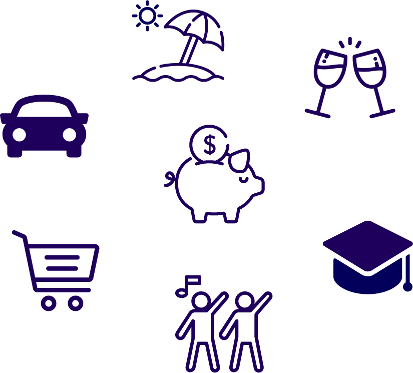

# Frave-One - Rails API for Frave: Goal Oriented Saving

Frave is a web application geared towards goal-oriented saving. Users create savings goals and add transactions to the goal to "pay it down". For example, the goal might be to save $1000 for a vacation. To add transactions (i.e. savings) to the goal, the user
will enter items and the amount they saved - if they saved $10.00 by using coupons, they can add this as a transaction towards the goal. 

When setting up a new goal, users set up customized rewards that they can redeem as they reach goal "milestones", i.e. 10% of the goal, 25% of the goal, etc. 

## Getting Started

Frave-One is built to be used with the front end React Client: Frave-React.

For development and testing, users should run both the rails server and the React client. 

## Prerequisites

1. Ruby on Rails v. 4 or higher
2. NPM

### Built With

* Ruby on Rails
* Create React App
* Ant Design
* Victory Charts

## In Progress

* Sign up Page
* React Native Implementation

## Demo Page Login

U/name: dany@dragonstone.gov
Pass: supersecret 

## Author

* Elise Yohm

## Acknowledgements

Big thank you to Junco Kumon at Junco Marketing & Media Co. for designing the logo, assisting with colour choices and the landing page and "Goal Show" page layouts. 
